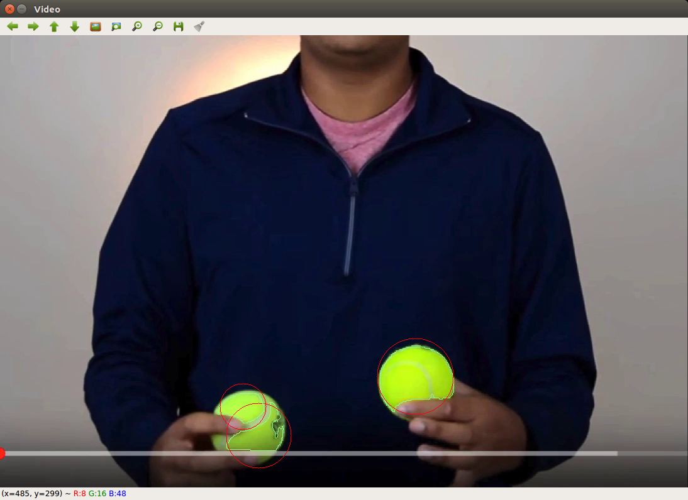
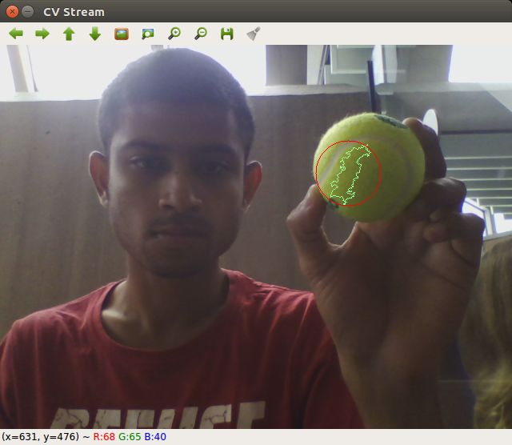

# Tennis_Ball_Detector_using_ROS_and_OpenCV

### Dependencies:
Ros-Kinetic <br>
Python <br>
OpenCV

### Goal
This was done as part of the exercises of the Udemy course [ROS for Beginners: Basics, Motion, and OpenCV](https://www.udemy.com/ros-essentials/learn/v4/overview) by Anis Koubaa. <br>
It is an example of a ROS publisher and listener. Here the publisher reads a video file and publishes each frame. The listener in turn reads each frame and tries to detect the tennis ball (if any) in it.

### Remarks
Since this is primarily an example of a publisher and listener interacting, the detector section is very basic. The detection can be improved by applying erosion and dilution. The color calbration is also presently done for the lighting conditions in the video. The ball detector code was tested with a USB camera as well but expectedly is very sensitive to conditions different from that in the video.

**Screenshot from Test with Video** <br>


**Screenshot from Test with USB Cam** <br>


### How to Run
```
git clone https://github.com/tridivb/Tennis_Ball_Detector_using_ROS_and_OpenCV.git
cp -R Tennis_Ball_Detector_using_ROS_and_OpenCV/ros_service_assignment <path>/<ros_workspace>
cd <path>/<ros_workspace>
# eg. cd ~/catkin_ws
catkin_make
## The following two commands need to be run in two different terminal sequentially
# 1
rosrun ros_service_assignment tennis_ball_publisher.py
# 2
rosrun ros_service_assignment tennis_ball_publisher.py
```
